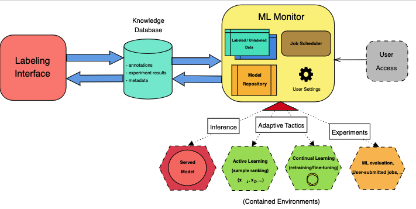
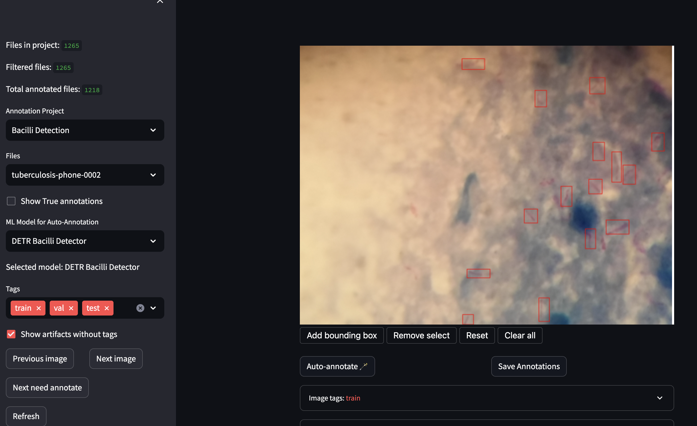
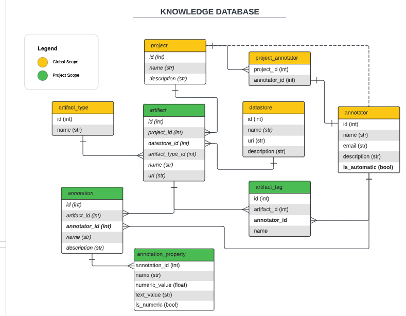

Continual Adaptation Applied to a Machine Learning Healthcare Platform (Master's Thesis)
==============================

Description of a continual adaption system for the detection of Mycobacterial Tuberculosis on Sputum images.

## Table of Contents

- [Abstract](#introduction)
- [System Architecture](#system-architecture)
- [Installation](#installation)
- [Deployment](#deployment)
- [Further Details](#further-details)

## Abstract

In this work, we combine ideas from self-adaptive system design and continual machine-learning literature to propose a framework for the continual adaptation of ML models. We implement our solution into a healthcare platform for the detection of Tuberculosis (TB), which is meant to be integrated into a data portal in the context of the ERA4TB project, a European initiative to accelerate the development of new drugs to treat TB. 

The platform includes a web-based interface made with **Streamlit** for the annotation of medical images, a data management system built with *SQLAlchemy* and *PostgreSQL*, and a pipeline for the continual training and evaluation of ML models.

I evaluated this solution by training an attention-based computer-vision model (DETR), adapting it to reliably identify TB bacteria in sputum-smear microscopy images. This model was trained incrementally, applying active learning tactics to select the most informative samples for each next training round. The experiments were conducted using as a baseline a DETR model trained on 202 images and achieved an AP@50 score of 0.824 on the test set.

With the proposed techniques, we were able to train a model that achieved comparable
performance to the baseline while being trained on 40% fewer images. We discuss the
challenges and potential of using continual learning techniques in this context, and how
certain limitations can be addressed in future work.

## System Architecture

The system is composed of various components that interact with each other. The following diagram shows the architecture of the system.



The main components are:

 - **The Labeling Interface**: A web-based interface for the annotation of medical images. 
 - **The Knowledge Database**: A database for the storage of the labeled data, model metadata, and other information that permit the launch of adaptation processes for the ML models.
 - **The ML Monitor**: A component that monitors the performance of the ML models and launches adaptation processes when needed.
- **The Adaptive Tactics**: A set of techniques that allow the ML models to adapt to new data and new tasks. The main relevant here are continual learning and active learning.

### The Labeling Interface



The labeling interface is a web-based application built with **Streamlit**. It allows the user to annotate images by drawing bounding boxes around the objects of interest. The interface also allows the user to visualize the images and the annotations, and to filter the images by their labels. The interface is connected to the knowledge database, which stores the annotations and the images.

In this web, users can also interact with the available ML models by visualizing their predictions on the images, comparing them with their own expectations, and adjusting the predictions if needed. This information is also stored in the knowledge database to feed the adaptive tactics.

### The Knowledge Database



The knowledge database is a PostgreSQL database that stores information about the images, the annotations, the models, and some properties/metadata about the adaptation processes using a data-first approach. The database is managed through **SQLAlchemy** and it is connected to the labeling interface and the ML monitor.

### The ML Monitor

Consists of a series of controllers that monitor the performance of the ML models and launch adaptation processes when needed. The controllers are implemented as Python scripts that are executed periodically with a job scheduler. 

Each model available to the system is deployed in a Docker container (see `ml-models/`) where the models are served through **FastAPI**. As such, the communication between the ML Monitor or labeling interface and the models is done via HTTP requests. 

## Deployment

All components can be deployed as containers using Docker. This project includes a `docker-compose.yml` file that allows the deployment of the whole system with a single command.

```bash
docker-compose up
```


## Further Details

If you want to get a more thorough description of the system, the experiments, and the results, please refer to the [thesis paper](./paper/main.pdf).
 
 You can also contact me personally if you have any questions or comments.

- **Contact**: [simsanch@inf.uc3m.es](mailto:simsanch@inf.uc3m.es) or [simonsviloria@gmail.com](mailto:simonsviloria@gmail.com)