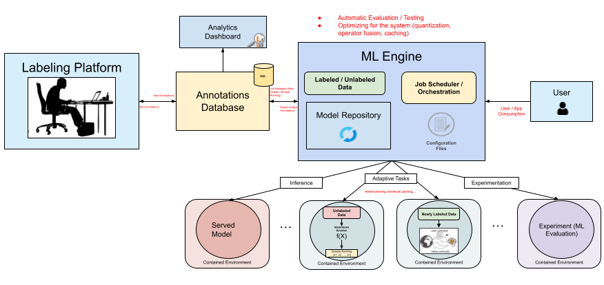

Continual Adaptation Applied to a Machine Learning Healthcare Platform (Master's Thesis)
==============================

Description of a continual adaption system for the detection of Mycobacterial Tuberculosis on Sputum images.

## Table of Contents

- [Introduction](#introduction)
- [System Architecture](#system-architecture)
- [Installation](#installation)
- [Usage](#usage)
- [References](#references)

## Introduction

`#TODO`

## System Architecture

`#TODO`

## Installation

`#TODO`

## Usage

`#TODO`

## References

`#TODO`

## License

[MIT](https://choosealicense.com/licenses/mit/)

## Contact

- [simsanch@inf.uc3m.es](mailto:simsanch@inf.uc3m.es) or [simonsviloria@gmail.com](mailto:simonsviloria@gmail.com)
- [simonsviloria.notion.site](https://simonsviloria.notion.site)